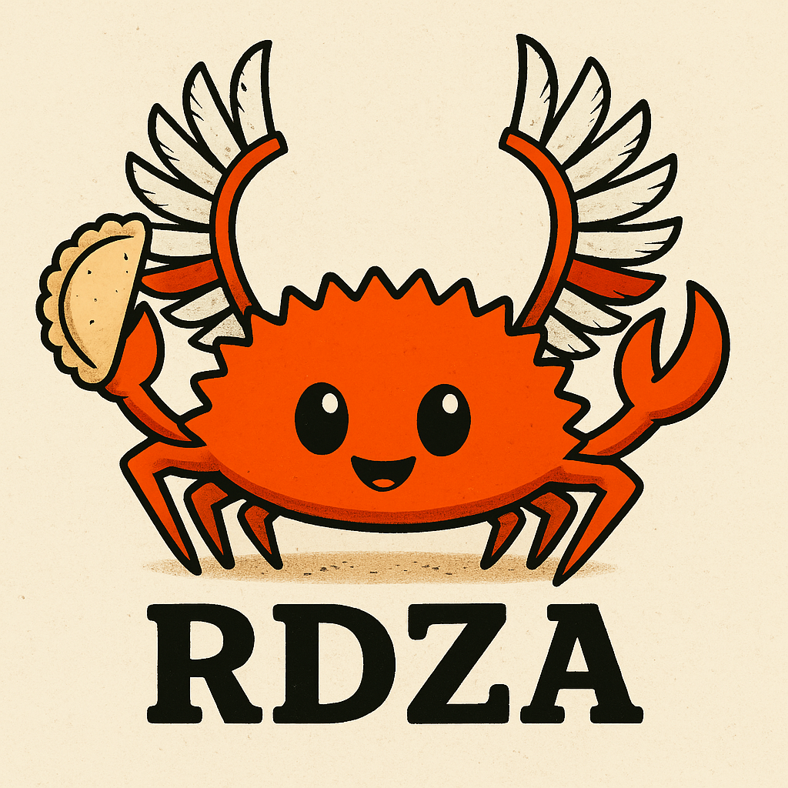

# rdza

<p align="center"></p>

Czy nie jesteś _zmęczony_ pisaniem programów w Ruscie po angielsku? Lubisz często mówić
"kurwa"? Chciałbyś spróbować czegoś innego, w egzotycznym i
zabawnie brzmiącym języku? Chciałbyś dodać polski charakter do swoich
programów?

**Rdza** (polskie słowo na _Rust_) jest tutaj, aby uratować Twój dzień, ponieważ pozwala Ci
pisać programy w Ruscie po polsku, używając polskich słów kluczowych, polskich nazw funkcji,
polskich idiomów.

Nie czujesz się komfortowo używając tylko polskich słów? Nie martw się!
Polski Rust jest w pełni kompatybilny z angielskim Rustem, więc możesz mieszać oba według
własnego uznania.

Oto przykład tego, co można osiągnąć z Rdzą:

## struct and impl (czyli Struktura i Implementacja)

```rust
rdza::rdza! {
    użyj std::zbiory::Słownik;

    cecha KluczWartość {
        fn zapisz(&sam, klucz: Tekst, wartość: Tekst);
        fn czytaj(&sam, klucz: Tekst) -> Wynik<Opcja<&Tekst>, Tekst>;
    }

    statyczny zm SŁOWNIK: Opcja<Słownik<Tekst, Tekst>> = Nic;

    struktura Konkretna;

    impl KluczWartość dla Konkretna {

        fn zapisz(&sam, klucz: Tekst, wartość: Tekst) {
            niech słownik = niebezpieczny {
                SŁOWNIK.pobierz_lub_wstaw_z(Domyślny::domyślny)
            };
            słownik.wstaw(klucz, wartość);
        }

        fn czytaj(&sam, klucz: Tekst) -> Wynik<Opcja<&Tekst>, Tekst> {
            jeśli niech Coś(słownik) = niebezpieczny { SŁOWNIK.jako_ref() } {
                Dobry(słownik.pobierz(&klucz))
            } inaczej {
                Błąd("Pobierz słownik".do())
            }
        }
    }
}
```

## Inne przykłady

Zobacz [przykłady](./examples/src/main.rs), aby zobaczyć jak działa cała
składnia. Bardzo dobrze!

## ale po co to robić?

[Francuzi](https://github.com/bnjbvr/rouille), [Holendrzy](https://github.com/jeroenhd/roest), [Niemcy](https://github.com/michidk/rost) mają, to my też!

Poland can into Rust!

## Współpraca

Przede wszystkim, dziękuję bardzo za rozważenie udziału w tym żarcie,
polski rząd będzie ci wdzięczny później! Bazujące na niemieckiej wersji, [Shemnei](https://github.com/Shemnei/) i [michidk](https://github.com/michidk/). Vibe-translated przez [Piotr Migdał](https://p.migdal.pl/) przy użyciu Claude 3.7.

## Licencja

[WTFPL](http://www.wtfpl.net/).

Polski rak - obraz wygenerowany przez OpenAI.
